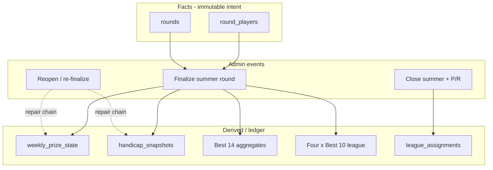

# WAGS rebuild — build guide (living reference)

Single source of truth for **vision, domain facts, and target structure** before implementation. Update this file as decisions change.

---

## 0. Stakeholders & access

| Fact | Detail |
|------|--------|
| Readership | ~**66** members view results/stats/handicaps (read-only). |
| Administration | **One** operator (you): campaigns/competitions, rounds, scores, finalize, money, danger operations. |
| Implication v1 | No multi-admin RBAC required; protect **admin/service** paths and keys; public snapshot can stay simple. |

---

## 1. Design principle: facts vs derived

| Class | Rule | Examples |
|-------|------|----------|
| **Facts** | Never silently edited; auditable source of truth. | Who played; optional **gross** strokes (**§2.4**); **`stableford_points` — net** (as entered, after handicap for the day); competition type; **entry fee paid**; **snake/camel counts** (fines); round date; season/competition linkage. |
| **Derived** | Recomputable from facts + rules version; may be cached/materialized for performance. | Handicaps after adjustment; league membership/rankings; Best 14 / Best 10 tables; weekly winner; rollover balance; bank totals; match-play advancement; finals qualification flags. |

**Rule of thumb:** if a treasurer or member could dispute it, the **canonical** value should either live in **facts** or in an **immutable snapshot row** (e.g. handicap snapshot after a round) with clear provenance—not only in a rolling aggregate table with no history.

---

## 1B. Do we really need “seasons”?

**You need a grouping object — you do not need the word `seasons`.**

Something in the database must answer: *“Which **Main summer 2026** weekly rounds count toward **this** Best 14, **these** four leagues, **this** rollover chain, and **these** league assignments?”* and separately: *“Which rounds belong to **Winter 2026** reduced comp?”* That scope is a **campaign** (or **edition**, **series year**, **club_year_track** — pick a name you like).

| What you actually run | Role |
|-------------------------|------|
| **Main summer 2026** | The **big** campaign: weekly stableford (**only** place handicaps adjust), **RS Cup** (knockout in parallel), **four leagues**, **Best 14**, **§6** money/rollover, **Champions / Chumps on the last day** of this campaign. |
| **Winter 2026** | **Reduced** campaign: **§9** money (weekly £5 split day/end pot); Best 10 single table; **no** handicap movement; **no** four leagues / Best 14. |
| **Away days** | **Random** dates; still **`rounds`** with flags (typically no handicap / no bank); can hang off the **summer campaign** for reporting or sit as one-off `away_day` competitions linked to the same **calendar club year** — implementation choice. |

**Implementation options (all valid):**

1. Keep a table called **`seasons`** but treat each row as **“Summer 2026”** / **“Winter 2026”** (two rows per calendar year when both exist) — minimal rename churn.
2. Rename to **`campaigns`** or **`editions`** with `track = main_summer | winter_reduced` and `year = 2026`.
3. **No extra table:** one parent **`competition`** per campaign (e.g. “Main summer 2026”) and hang weekly rounds + cup + finals under typed child competitions — works if every query can still resolve “summer 2026 scope” in one hop.

**Recommendation:** one **campaign row per (year, track)** you care about (at least **Main summer 2026** and **Winter 2026**), whatever the table name — so **league_assignments**, **rollover**, and **Best 14** all share a single **foreign key** and you never infer scope from date strings alone.

The rest of this doc still says **`seasons`** in places; read that as **campaign** until migrations pick the final table name.

---

## 1A. Full operational flow (as understood)

This section ties **§0–§10** into one story: **who does what**, **when state changes**, and **what recalculates**. It is the narrative complement to the structured rules below.

### A. Calendar and “which campaign is live”

1. In a given **calendar year** you run **two campaigns** with **different rulesets**, e.g. **Main summer 2026** (~Apr–mid-Oct) and **Winter 2026** (~Nov–Mar). They are **not** interchangeable: winter is a **reduced** comp.
2. **During Main summer 2026:** the **weekly main stableford**, **RS Cup** knockout, **four leagues**, and **Best 14** all **belong to this campaign** (separate `competition` rows, same campaign / `season` FK). **Rollover (§6.1)** applies across **summer weekly** rounds in **this** campaign only.
3. **Champions / Chumps** happen on the **last day** of the **main summer** campaign (same closing boundary as “end of summer” for P/R — **§1A.E**).
4. **Away days** occur on **random** dates; model as **`rounds`** (and optional one-off prizes) with default **no** handicap / **no** bank/league — still link to **Main summer 2026** (or club year) for sanity in reports (**§10**).
5. **Members (~66)** only **consume** published data. **You (admin)** create campaigns, competitions, rounds, enter scores, **finalize** / **reopen**, close the summer campaign, run P/R, etc.

### B. Bootstrapping **Main summer 2026** (campaign)

1. **Admin** creates the **summer campaign** row (table might be `seasons` or `campaigns`): label **“Main summer 2026”**, dates, **summer `ruleset_id`**, status `draft` → `open`.
2. **Admin** creates child **`competition`** rows: at minimum **`summer_series`** (weekly rounds), **`rs_cup`** (bracket), and **`finals`** / medal comps for **Champions & Chumps** scheduled on the **last day** of the campaign. **Away_day** rounds can be added any time with random dates.
3. **League assignment (§4.0):** for **this** summer campaign only, every member gets **exactly one** of four tiers (15 / 15 / 15 / rest).
4. **Tiers stay fixed** until **end of campaign** + P/R (**§1A.E**). **Best 14** and **four × Best 10** tables only include rounds scoped to **this** main summer campaign’s weekly stableford (define whether **RS Cup / away** scores are excluded — default: **exclude** unless a round is explicitly flagged into Best 14).

### C. Normal **summer weekly** week (main WAGS)

1. **Admin** creates a **`round`** under **`summer_series`** for that campaign (played date, `par_holes` / `course_par`, notes).
2. **Facts captured** in **`round_players`** per member: `entered`, optional `gross_score`, **`stableford_points`** (**net** stableford — the figure used for leaderboards, money ties, and summer handicap **§3.3**), `snake_count`, `camel_count`, `entry_fee_pence` (typically **500** if £5), `disqualified` as needed. These are **never silently rewritten** once treated as submitted; corrections go through admin/reopen paths.
3. **Admin finalizes** the round (single commit boundary):
   - **Money (§6):** For each entrant, **£3.50×N** to bank from the base £5; **£1.50×N** into the **winner pool** for that week. **Snake/camel:** **£1** per count **each** to bank **on top of** the £5 split. **Winner pool resolution (§6.1):** if **exactly one** player has the highest **net** stableford score → assign **`winner_member_id`**, pay **`paid_out_pence`** = that week’s **£1.50×N** slice **plus any rollover carried in**. If **two or more** share the top score → **no** payout, **no split**; add this week’s **£1.50×N** to **rollover** for the **next** summer weekly round. Repeat tied weeks **stack** rollover until a later week has a **sole** winner, who takes the **entire accumulated** winner pool.
   - **Handicap (§3.0–§3.3):** only when finalizing a **`summer_series`** round — apply bands and **`handicap_snapshots`** once per `(member_id, round_id)`. **Skip** for cup, finals, away, winter.
   - **Derived leaderboards:** refresh **Best 14** (whole club, summer series) and **four division tables** (Best **10** within each division) from all **finalized** eligible `round_players` to date (**§5**).
4. **Members** see updated tables, results, handicaps, and money outcomes via the app’s **read contract** (single snapshot or equivalent).

### D. **Reopen** and **ordered replay** (admin repair — handicap + **§6** integrity)

#### D.0 Single-round repair

If only the **latest** finalized week needs a tweak, **reopen → edit facts → re-finalize** that round alone, still **superseding** prior ledger/snapshot rows for that `round_id` so there is **no double entry** (**§3.4**, **`weekly_prize_state`** versioning).

#### D.1 Late correction — **earlier** week wrong after **later** weeks finalized (e.g. week 3 missing, weeks 4–5 done)

**Problem:** Week **5** is finalized but a score was **never** entered for **week 3**. Handicaps for weeks **4–5** were computed from a chain that assumed week 3’s truth; **rollover** for weeks **4–5** may depend on week 3’s winner/tie outcome. You **must not** silently edit week 3 while 4–5 stay finalized — that breaks **finance** and **handicap** order.

**Required approach — unroll, fix, replay in chronological order:**

1. **Invalidate downstream finalized weeks** — Reopen **week 3** and every **`summer_series`** week **after** it that is still finalized (**4, 5, …** in play order), **or** run one admin action “**repair from week 3**” that marks rounds 3–5 non-final and **voids / supersedes** their active **`weekly_prize_state`** and **`handicap_snapshots`** for those rounds in a controlled transaction. Goal: **no active ledger row** claims money for week 4 or 5 until the chain is replayed.

2. **Enter missing facts** — Complete **`round_players`** for week 3.

3. **Re-finalize in strict week order:** **3 → 4 → 5 → …**  
   - **Money:** each week’s **§6** run uses **`rollover_carried_in`** from the **newly recomputed** previous week only (week 4’s carry-in re-reads week 3’s new `rollover_carried_out` / winner outcome).  
   - **Handicap:** week 3 finalize writes fresh snapshots; week 4 finalize reads “handicap before” **after** week 3’s new state; week 5 after week 4, etc. (**§3.0–§3.3**).

4. **No double entry (finance):** at most **one active booked row** per `round_id` for `weekly_prize_state` (and any `finance_events`); supersede or delete prior versions inside the same repair job — **Finances** must show the **current** chain only (**§11.2**).

5. **No double adjustment (handicap):** same for **`handicap_snapshots`** per `(member_id, round_id)` — void old, apply once on re-finalize (**§3.4**).

6. **Derived tables** — Rebuild **Best 14** / **four × Best 10** after the chain (or incrementally after each re-finalize).

**Admin UX (recommended):** a **“Repair from week N”** wizard: lists dependent weeks (N+1…), shows **Finances diff** warning, requires confirmation, then runs **ordered re-finalize** (or guides you step-by-step with audit log).

---

### E. **End of Main summer 2026** (last day includes Champ / Chumps)

1. **Last scheduled day** of the campaign: run **Champions / Chumps** medal rounds (or finalize them) as part of the same **close campaign** boundary (**§8**).
2. **Admin** **closes** the **Main summer 2026** campaign row (**§2.1**).
3. **Promotion / relegation (§4.2)** runs **once** for the **next** summer campaign’s starting tiers; persist new **`league_assignments`** (**§4.4**).

### F. **Winter 2026** (reduced campaign)

1. **Admin** creates **Winter 2026** campaign row: **winter `ruleset_id`**, dates, competitions, rounds — same **`round_players`** fact pattern.
2. **Finalize** winter rounds: **no** handicap adjustment engine (**§3.4**); **no** four leagues; **no** Best 14.
3. **Single leaderboard:** each member’s **Best 10** stableford scores across winter → **one** ranked list (**§5.1**). **Money:** **§9** (not summer **§6**).

### G. **RS Cup** (during **Main summer**; not the four leagues)

1. **`rs_cup` competition** under the **same summer campaign** as weekly golf; **preliminary → 16 KO matches → final** (**§7**).
2. Results **advance** players through the bracket; **reopen** upstream forces **downstream** recomputation.
3. **Handicap / money** for cup: **no** handicap movement (**§3.0**); **no** cup money (**§7**).

### H. **Away days** (random dates)

1. **`rounds`** on **whichever date** occurs; default flags: **no** handicap, **no** bank/league (**§10**). Link to **Main summer 2026** (or club year) for reporting consistency.

### I. **Champions / Chumps** (last day — **§8**)

1. **Champions** = any member who was the **sole outright winner** of **at least one** main **`summer_series`** weekly round that summer (**§6** / **`winner_member_id`** for that week — **tie weeks do not qualify anyone**). **Confirmed — no joint Champs from ties.**
2. **Chumps** = **everyone else** in the club who plays finals day (all members who are **not** in the Champions set for that summer).
3. **Money (finals day):** **£5** per entrant **Champions and Chumps**; **100%** of the **combined** pot to the **sole Chumps winner**; **Champions** — trophy only (**§8.2**).
4. Held on the **last day** of **Main summer** before or as part of **close campaign** (**§1A.E**).

---

### J. Data lineage (mental model)

---

## 2. Target structure (entities)

Names below are the **intended domain model** (not necessarily current `wags` table names). Align migrations to this vocabulary.

### 2.1 `seasons` (or `campaigns`) — **Main summer YYYY** vs **Winter YYYY**

See **§1B** for naming (`seasons` vs `campaigns`). In practice you run **Main summer YYYY** and **Winter YYYY** as **two rows per calendar year** when both exist.

- **Main summer:** weekly stableford (**§3.0** — **only** those finalized rounds adjust handicaps) + **RS Cup** + four leagues + Best 14 + **§6**; **Champ/Chumps last day**; **away days** random `round_date` but same campaign FK optional.
- **Winter:** reduced — **§9** weekly £5 model + end pot for **Best 10** winner; no four leagues, no Best 14, no handicap movement (**§3.0**).
- **Typical windows:** Apr–mid-Oct / Nov–Mar on the campaign row.
- **`ruleset_id`:** must differ summer vs winter.
- **`status`:** `draft` → `open` → `closed`; closing **Main summer** triggers **§4.2** P/R for **next** summer tiers after last-day finals.

**Admin fields:** `kind`/`track`, `label` (e.g. “Main summer 2026”), dates, `ruleset_id`, `status`. **Editing/closing:** admin only (**§1A.E**).

### 2.2 `competitions` (children of a campaign)

- **Program types** align with **§2A**: e.g. `summer_series`, `rs_cup`, `winter_series`, `finals_medal`, `away_day` (exact enum names TBD in migrations).
- **Main summer** campaign: typically **`summer_series` + `rs_cup` + `finals_medal`**, plus **`away_day`** competitions — same parent campaign FK. **Winter** campaign: **`winter_series`** only (no RS Cup / four leagues unless you add them).
- **Flags** (explicit booleans or enums), e.g. `affects_handicap`, `affects_bank`, `affects_leagues` — so one engine can branch by program without new tables per track.
- One competition groups many **rounds** of the same program (e.g. whole summer stableford sequence, whole winter sequence, one cup bracket).

### 2.3 `rounds`

- **One row per played date/event.**
- `competition_id`, `status` (scheduled / open / finalized / reopened…), **`par_holes`** (e.g. 10), **`course_par`** (e.g. 20), notes.
- Belongs to exactly one competition (hence one **campaign** / `season`).

### 2.4 `round_players` (or equivalent: one row per member in that round)

Per member in that round:

- `entry_fee_pence` (or smallest currency unit).
- `entered` (bool) — played / eligible vs DNS.
- **`gross_score`** — optional **gross** strokes for the round (nullable if you only record stableford). **Encourage** filling when known for audit and cross-checks.
- **`stableford_points`** — **net** stableford for the round (**as entered** — already reflects handicap for the day). All **rankings**, **weekly winner** detection, **Best 14/10**, and **§3.3** **`S`** use this **net** value.
- `snake_count`, `camel_count` (fine counts as entered).
- `disqualified` (and any other eligibility flags).

This table is the **core fact table** for scoring and money inputs.

---

## 2A. Four competition programs (orthogonal “tracks”)

The club runs **four kinds of program**. Each can differ on **leagues**, **best-N tables**, **handicapping**, and **finances**—encode differences via **`competition` type + flags + `ruleset_id`**, not ad hoc branching in the UI.

| Program | Role | Notes |
|--------|------|--------|
| **(a) Main summer WAGS** | Primary weekly stableford under **Main summer YYYY** | **Four divisions** (§4), **Best 14**, **Best 10** per division, **§6** money — **RS Cup** is a **sibling** `competition` in the **same** campaign, not part of league tables. |
| **(b) RS Cup** (FA Cup–style knockout) | Cup / bracket | **§7** — preliminary round, then **16 first-round matches** through to **final**; not part of the four summer divisions. |
| **(c) Winter series** | Secondary series | **`winter_series`**: **§9** money (weekly £5 split); **Best 10** single leaderboard + **end pot** for series winner. |
| **(d) Occasional away day** | Social / optional | Typically **no** handicap movement, **no** bank/league effects unless you override per round (§10). |

**Rules matrix (fill as you lock details):**

| Program | Affects leagues? | Best table | Affects handicap? | Affects bank / weekly pot? |
|--------|------------------|------------|-------------------|----------------------------|
| Main summer | Yes (4 divisions; **P/R at season end** §4.2) | Best **14** (series) + Best **10** (per division league) | **Yes — only `summer_series` weekly rounds** (**§3.0**) | Yes (**§6** weekly £5 entry split) |
| RS Cup | No (not summer league ladder) | Bracket / match results | **No** (**§3.0**) | **No** — **no** entry fees or prize pot from the cup (**§7**) |
| Winter | No (single table) | Best **10** in series, **one** ranked list | **No** (**§3.0**) | Yes (**§9.1–9.2**: £2.50×N day winner + £2.50×N end pot → **Best 10** outright winner) |
| Away day | No | Usually none | **No** (**§3.0**) | No (default) |

---

## 2B. Priority queries & workflows (build these first)

These are the **highest-value read models** and the **write path** they depend on.

| # | Workflow / query | Program | Output |
|---|------------------|---------|--------|
| 1 | **Summer Best 14** | Main summer | Each member’s **top 14 stableford scores** across the summer series, **ranked** (total or display order defined in one place). |
| 2 | **Summer league tables (×4)** | Main summer | **Premiership, Championship, League One, League Two** — each division: members ranked by **Best 10** stableford scores **within that division** for the summer (only rounds that count for that division’s league). |
| 3 | **Winter series leaderboard** | Winter | **One** ranked list: each member’s **Best 10** scores in the winter series, ranked (not four divisions). |
| 4 | **Finalize round** | Program-dependent | **`summer_series`:** **§6** + **§3**; **`winter_series`:** **§9.1–9.2** (no handicap); **`finals_medal` / §8:** money per **§8** (no handicap); cup/away: no **§3**; **reopen:** §3.4. **P/R** at end of main summer (**§4.2**). |
| 5 | **Reopen + replay chain** | Admin repair | **§1A.D.1** — void downstream weeks’ finance + handicap effects, edit facts, **re-finalize 3→4→5…** so rollover and snapshots stay consistent; **no** double entry (**§11.2**). |
| 6 | **RS Cup bracket** | RS Cup | Preliminary → **16** first KO matches → … → **final**; advancement + reopen **§7**. |

Implement **(1)–(3)** off the same fact tables; differ only by **which rounds qualify** and **N** (14 vs 10) and **partition** (division vs whole club).

---

## 3. Handicaps

### 3.0 Scope (confirmed)

**Handicap index only moves from finalized rounds in the `summer_series` (main summer weekly stableford) competition.**

It does **not** change from:

| Context | Handicap |
|---------|----------|
| **Winter** series rounds | **No** |
| **RS Cup** / knockout match results | **No** |
| **Champions / Chumps** (finals medal) | **No** |
| **Away days** | **No** |

Implement by gating the §3.2–3.3 engine on **`competition.type = summer_series`** (or equivalent) **and** `affects_handicap = true` for that program — all other programs keep `affects_handicap = false` for finals, cup, winter, and away.

### 3.1 `handicap_snapshots` (after each **adjusting** round)

- `member_id`, `round_id`, `handicap_before`, `handicap_after`, provenance for debugging.
- `rule_version` and/or **JSON blob of applied deltas** (optional) so replays are explainable.

### 3.2 Rule band (from handicap **before** the competition round)

Bands drive **buffer zone** and **cut factor**. Use the player’s **handicap index immediately before** this round’s adjustment (per your operational definition—usually post–prior-round snapshot).

**Effective index for this table:** **`H_eff`** = that pre-round index **rounded half up to a whole stroke** (same rule for **plus** / scratch-adjacent values): **5.1→5**, **5.5→6**. Use **`H_eff`** only to choose the row below (**B**, **C**). **Stored** index and **§3.3** deltas remain at **tenth** precision (±0.1) unless you widen in a future ruleset. **Plus handicappers** use the same band table on **`H_eff`** — no separate branch; verify boundary comparisons numerically (e.g. **≤10** vs **>10**).

| Condition (**`H_eff`** before round) | Buffer zone | Cut factor |
|-----------------------------------|-------------|------------|
| ≤ 3.0 | 19 | 0.1 |
| ≤ 7.0 | 18 | 0.2 |
| ≤ 10.0 | 17 | 0.3 |
| Else (effectively **> 10.0**, incl. 11.0+) | 16 | 0.4 |

### 3.3 Adjustment from Stableford score (per player, per adjusting round)

Let `S` = **net** stableford points entered for the round (same field as **`round_players.stableford_points`**), `B` = buffer zone, `C` = cut factor.

1. **If `S` > 20:** handicap **decreases** by **better = lower index** (WHS-style); UI copy and arrows must match.  
   **Magnitude:** `(S − 20) × C` in **index tenths** (same unit as the **+0.1** step); store the applied delta in the snapshot.
2. **Else if `S` < B:** handicap **increases** by **+0.1** (index tenths).
3. **Else** (**`B` ≤ `S` ≤ 20**): **plateau — no change** to the stored index for this round.

**Display / UI:** show members their handicap as **`H_eff`** (integer, half up) unless a drill-down shows tenths; engine **must** use the same rounding for **§3.2** as for display to avoid “5.5 shows 6 but band used 5” bugs.

All of the above lives in **versioned rules** (one code/SQL surface); DB keeps **inputs + `handicap_snapshots`**.

### 3.4 When applied; finalization & reopen integrity (incl. **ordered replay**)

- **Apply handicap changes on finalization** of an **adjusting** round (not on every autosave of scores).
- **Integrity:** at most **one** applied adjustment event per `(member_id, round_id)` in the canonical ledger; **reopen** must either:
  - **Reverse** prior snapshot rows for that round and re-run finalize, or
  - **Mark superseded** and replace with a new snapshot chain,  
  so replays never **stack** two full adjustments for the same finalized round.
- **Cascade:** if an **earlier** `summer_series` week is reopened, every **later** finalized week in that campaign that depends on rollover or handicap order must be **voided and re-finalized in chronological order** — **§1A.D.1**.

Handicap **numeric rules** (§3.2–3.3) run **only** for **§3.0** scoped rounds; they live in **one versioned surface** (Edge vs SQL—pick once); keyed by **`ruleset_id`** and competition flags. DB stores **inputs + snapshots** (§3.1). **Winter, RS Cup, finals (Champ/Chumps), and away-day** finalized rounds **never** invoke this engine.

---

## 4. Leagues (main summer only)

### 4.0 League membership rules

- **Exactly one league (tier 1–4) per member per summer season** — no dual membership.
- **Initial assignment (summer start):** migrate from **current** standings / admin seeding policy:
  - **Tiers 1–3 (Premiership, Championship, League One):** **15 players** each (**45** total in top three divisions).
  - **Tier 4 (League Two):** **all remaining** members (typically ~21 with ~66 members — adjust if squad size changes).
- **During the season:** tiers are **stable** (no automatic mid-season demotion); standings update from **Best 10** results within each division.
- **Admin** may correct a mis-assignment; every change should be **auditable** (fact or admin action row).

### 4.1 Four divisions (fixed names)

| Tier | Name |
|------|------|
| 1 | **Premiership** |
| 2 | **Championship** |
| 3 | **League One** |
| 4 | **League Two** |

### 4.2 Automatic promotion / relegation (**end of summer season**)

- **When:** run once as part of **closing the summer season** (or explicit admin “apply P/R” after last round — same transaction boundary as season close). **Not** on every weekly finalize.
- **Rule:** **Top 3** in each of divisions **2–4** are **promoted**; **bottom 3** in divisions **1–3** are **relegated**. **Premiership:** no promotion in. **League Two:** no relegation out.
- Persist new **`league_assignments`** rows for the **next** summer season (or `effective_from` next season start) so history stays queryable.

### 4.3 `league_assignments`

- `season_id`, `member_id`, `league_tier` (1–4) mapped to the names above.
- **Effective range:** e.g. `effective_from_round_id` or date, and `effective_to_*` when superseded.

### 4.4 History

- **Within-season:** append or version rows only when **admin** changes a tier (optional audit).
- **Between seasons:** after **§4.2** P/R, new effective rows for the new summer; retain closed rows for “who was in Championship after summer 2025.”

**RS Cup / winter / away:** do **not** assign summer four-division tiers unless you explicitly add a rule (default: **no**).

---

## 5. Best 14 / Best 10

### 5.1 Program-specific definitions

| Program | Table / view | Rule |
|--------|----------------|------|
| **Main summer** | **Best 14** (series) | Each member: **top 14** stableford scores across **`summer_series`** rounds only → sum or display sorted scores → **rank** full member list. |
| **Main summer** | **League (×4)** | Within each division: each member’s **Best 10** scores from **`summer_series`** rounds only → **rank** (top 10 per member for standing—align with current “best 10 league” semantics). |
| **Winter** | **Single leaderboard** | Each member: **Best 10** scores from **`winter_series`** rounds only → **one** ranked list (no Premiership/Championship split). |

**Exclusions (summer Best 14 / summer division Best 10 / winter Best 10):** **Do not** count **`rs_cup`**, **`away_day`**, **`finals_medal`**, or any competition **other** than the series weekly stableford **`summer_series`** / **`winter_series`** row for that campaign.

### 5.2 Implementation

- **Inputs:** `round_players` (eligible rows only—respect `entered`, `disqualified`, and competition flags). **Scores:** use **`stableford_points`** as **net** stableford (**§2.4**).
- **Derived:** materialized or RPC-computed; optionally `season_aggregate_scores` with `included_round_ids[]`.
- **Refresh:** on finalize (and on reopen after repair); **one primary** implementation (prefer SQL/RPC) so app does not re-implement ranking.

---

## 6. Weekly money — **main summer stableford** (£5 entry per player)

Per **competition round** (weekly event), from each playing member’s **£5.00** entry (store as **500 pence** in facts). **Winner detection** uses **net** stableford (**§2.4**).

| Allocation | Amount | Destination |
|------------|--------|-------------|
| **Winner pool** | **£1.50** (150p) **per entrant** that week | Contributes to the week’s pot; paid to **one** sole outright winner **including all rolled-in** amounts from prior tie weeks — **§6.1** (**no** split on ties). |
| **Club bank** | **£3.50** (350p) | Bank / house share from the base £5. |
| **Snake** | **£1.00** (100p) **each** | To **bank** (per snake count entered for that player-round). |
| **Camel** | **£1.00** (100p) **each** | To **bank** (per camel count entered for that player-round). |

**Arithmetic check (base £5 only):** £1.50 + £3.50 = £5.00 — the **snake/camel £1** lines are **in addition** to the £5 split (fines to bank). Implement as separate ledger lines so treasurer reports stay clear.

### 6.1 Ties and rollover (winner pool — **no split**)

- **Rule:** **Any** tie for the top **net** stableford score (two-way **or** multi-way) means **no** £1.50-per-player winner payout that week: **nothing** from the winner line is split between joint leaders (e.g. **not** 75p/75p for a two-way tie).
- **Rollover:** the whole **£1.50 × entrants** slice for that week that would have gone to a single winner **rolls forward** and **adds to** the accumulated winner pool for the **next** summer weekly round.
- **Stacking:** if several consecutive weeks tie, the **rollover balance keeps growing** each tied week until a week produces **one** outright winner — that winner receives **the full accumulated pool** (that week’s £1.50×entrants share **plus** all rolled-in amounts), subject to your ledger recording (single `paid_out_pence` line or audit trail).
- **Detection:** count of players at the winning score ≠ 1 → tie week → `winner_member_id` **null**, rollover out = previous rollover + this week’s winner-line contribution.
- **Application:** persist in **`weekly_prize_state`**: `rollover_carried_in`, `rollover_carried_out`, `winner_member_id`, `paid_out_pence` so treasurer and app stay aligned.

**Implementation:** one **pure function** (inputs: entry count, winning score + count of players at that score, snake/camel totals, previous rollover) + **golden tests** (e.g. 3 tied weeks then a sole winner).

### 6.2 `weekly_prize_state` (per summer weekly round)

Suggested fields (pence) — align names to §6.1 behaviour:

- `round_id`
- `pot_from_entries_pence` (e.g. `500 × players`)
- `rollover_carried_in` / `rollover_carried_out`
- `winner_member_id` (nullable on tie / rollover week)
- `paid_out_pence` (winner share actually paid)
- `to_bank_pence` (includes **£3.50×players** base bank slice + **£1×(snakes+camels)** for that round)
- Optional: `superseded_at` / `version` for **§1A.D.1** repair chains (**§11.2**).

### 6.3 Rollover chain integrity when **reopening** an earlier week

The winner-pool rollover is **sequential**: week *k*’s `rollover_carried_in` is defined by week *k−1*’s outcome. If week **3** is fixed after **5** was finalized, weeks **4 and 5**’s booked `weekly_prize_state` rows are **invalid** until you **re-finalize 3, then 4, then 5** in order (**§1A.D.1**). Implement **superseded** ledger rows or equivalent so **Finances** never shows two active payouts for the same round.

---

## 7. RS Cup (FA Cup–style knockout)

**Scope:** Straight knockout cup, **not** part of the summer four-division league ladder (**§4**).

**Shape (narrated):**

1. **Preliminary round** — reduces the field to fit the main draw (exact player count / byes **TBD** in schema or seed rules).
2. **First full knockout round:** **16 matches** (typically **32** players entering this stage; confirm if your draw uses different counts).
3. Subsequent rounds step down to **semi-finals** and **final** (standard bracket).

**Data model**

- **`match_play_bracket`** (or normalized tables): `campaign_id` / `season_id` (or cup edition id), `stage` (`preliminary` \| `r32` \| … \| `final`), `player_a`, `player_b`, `winner_id`, `score` / result payload, `next_match_id` or bracket slot indices.
- **Advancing winners:** derived from recorded results; **reopening** an upstream match must **invalidate and recompute** downstream results (same integrity idea as handicap reopen — **§3.4**).

**Rules matrix:** **Handicap: no** for cup (**§3.0**). **Money: none** — no entry fee, **no** `weekly_prize_state` / ledger lines from the cup itself (trophy / honour only if you record it elsewhere).

---

## 8. Finals — **Champions & Chumps** (last day of **Main summer**)

Medal / stableford **`rounds`** under `finals_medal` (or two child comps: `finals_champs`, `finals_chumps`). **`affects_handicap = false`** (**§3.0**). **Champions field:** **sole weekly summer winners only** (**§8.1**).

### 8.1 Who plays where

| Field | Who qualifies |
|-------|----------------|
| **Champions** | Members with **≥1** finalized **`summer_series`** week where they were the **sole** `winner_member_id` (**§6**). **Tie weeks:** nobody joins Champs from that week. |
| **Chumps** | **All other members** taking part on finals day — anyone **not** in the Champions set for that summer. |

**Rule (confirmed):** Champs eligibility is **sole weekly winner only** — same bar as the summer weekly money outright winner.

### 8.2 Money — finals day (**not §6**)

- **Everyone** who plays finals day pays **£5** (**500p**) — **Champions** and **Chumps** alike.
- **One combined pot:** **`500p × (N_champs + N_chumps)`**. **100%** of that combined pot is paid to the **sole Chumps winner** — **no** club bank slice from this pot. **Champions** receive **no cash** from this pot; they compete for the **Champions trophy** / honour only.
- Book dedicated ledger rows at finalize so **Finances** shows the full collection and the single Chumps payout.

### 8.3 Order of operations

Run **finalize** on finals **`rounds`**, then **close** the **Main summer** campaign and run **P/R** for next summer (**§1A.E**, **§4.2**).

---

## 9. Winter

- **Same** **`rounds` / `round_players`** pattern as summer for scoring facts.
- **No handicap movement** for winter — do not emit **`handicap_snapshots`** for adjustment from winter-series rounds (see **§2.1** / **§3.4**).
- **No** four-division leagues and **no** Best 14 — **only** the **single-club Best 10** leaderboard (**§5.1**).

### 9.1 Winter weekly money (**not §6** — separate rules)

Per **`winter_series`** round, each playing member pays **£5.00** (**500 pence**). On **finalize**, split each week’s pot (for `N` entrants):

| Slice | Amount | Goes to |
|-------|--------|---------|
| **Day winner** | **£2.50 × N** (250p × N) | **Sole** highest **net** stableford that week — same tie/rollover semantics as summer **§6.1** (see below). |
| **End-season pot accrual** | **£2.50 × N** (250p × N) | **Accrues** to a **winter campaign reserve** (not paid out weekly). **Always accrues** this slice on finalize — **unaffected** by a tie for the day winner. |

**Arithmetic:** £2.50N + £2.50N = **£5N** — the full weekly entry is accounted for.

**Day winner ties — same as summer §6.1:** Compare **net** stableford only. If **no** sole top score, **do not** pay the **£2.50×N** day slice that week and **do not** split it between joint leaders; **roll it forward** into the **next** winter week’s **day-winner** pot (stack until there is a sole winner). Rollover chain is **winter-only** (do not mix with summer rollover).

### 9.2 Winter **end pot** (best 10)

At **winter campaign close** (or last round), resolve the **accumulated end-season pot** (sum of all weekly **£2.50×N** accrual lines) from the winter **Best 10** leaderboard (**§5.1**), using **net** stableford aggregates:

- **Outright sole first** → that member receives **100%** of the end pot (single **`paid_out_pence`** line).
- **Two or more tied for first** → **split** the end pot **evenly** in **whole pence** among everyone tied for first (same idea as an explicit shared win; document remainder handling in **`ruleset_id`** — e.g. remainder pence to bank or deterministic assignee).

Persist weekly accrual and final payout in **`weekly_prize_state`**-shaped rows or a dedicated **`winter_end_pot_ledger`** so **Finances** can reconcile (**§11.2**).

---

## 10. Away days

- **`rounds`** on **arbitrary dates** (random in the year); default `affects_handicap = false`, `affects_bank = false` (**§1A.H**).
- Optional **`prizes`** child table for ad hoc awards (non-standard money).
- Link `competition_id` to **`away_day`** under **Main summer** campaign (recommended) so reports stay grouped by club year.

---

## 11. Admin dashboard (create / edit + **Finances**)

Single **operator** UI (service-role or server-side admin API — **never** embed the service key in the member PWA). It must support **creating and editing** every club entity, plus a **Finances** view: **prize pot allocation** and **monies booked** (ledger rows written at finalize), not only what the public app displays.

### 11.1 Scope — full CRUD

| Area | Create / edit (minimum) |
|------|-------------------------|
| **Campaigns** | Main summer YYYY, Winter YYYY — dates, `ruleset_id`, status; **close** summer and trigger **P/R** when appropriate (**§2.1**, **§4.2**). |
| **Competitions** | `summer_series`, `rs_cup`, `winter_series`, `finals_medal`, `away_day` — flags `affects_handicap`, `affects_bank`, `affects_leagues` (**§2.2**, **§3.0**). |
| **Rounds** | Date, par/course par, notes, status (draft → open → finalized / reopened) (**§2.3**). |
| **Scores / line-ups** | `round_players`: entered, optional gross, **net** stableford, snakes/camels, fees, DQ (**§2.4**). |
| **Finalize / reopen** | Runs **§6** money + **§3** handicaps **only** where rules apply; **reopen** with integrity (**§3.4**); **ordered replay** for earlier-week fixes (**§1A.D.1**). |
| **Leagues** | Initial tiers 15/15/15/rest; manual corrections with audit; **P/R** preview/apply at end of main summer (**§4**). |
| **RS Cup** | Bracket / matches; reopen cascade (**§7**). |
| **Danger zone** | Reset / bulk import — extra confirmations. |

Admin is the **only** write surface for club facts; the **66-user** app stays read-only on that data.

### 11.2 **Finances** view — allocation + **booked** monies

Treat **“baked”** as **booked**: show **persisted** numbers from **`weekly_prize_state`** (and any **`finance_events`** / ledger you add), reconciled to **`round_players`** inputs for that round.

**Per finalized summer weekly round (`summer_series`):**

- Entrants `N`, entry total **500×N** pence.  
- **Winner pool:** **150×N** in + **rollover carried in** → either **`paid_out_pence`** (sole winner) or **rolled forward** (tie) — **§6.1**.  
- **Bank:** **350×N** from base £5 + **100×(snakes+camels)** (fines to bank) — **§6**.  
- Optional **balance check** row (warn if inputs ≠ booked outputs).

**Campaign rollup (e.g. Main summer 2026):** totals to bank, totals paid to winners, **open rollover** if the last week hasn’t cleared a tie chain.

**Winter / cup / away / finals:** show booked rows per program — **§9** winter weekly + end pot; **§8** Chumps full pot; cup when defined (**§7**).

**Export:** CSV of finance rows joined to round date / competition for treasurer.

**UX:** Finances for finalized rounds are **read-only** unless admin uses **reopen** / **repair-from-week-N** (**§1A.D**; then show superseded history if you version ledger rows). Scores on **open** rounds do **not** mutate `weekly_prize_state` until **finalize**. Display **pence** internally, **£** in UI.

---

## 12. Implementation checklist (to fill as we build)

- [ ] ERD matching §2–10 exported or linked from this repo.
- [ ] Single **rules engine** location chosen (Edge vs SQL vs other).
- [ ] Single **read contract** for the 66-user app (versioned JSON).
- [ ] Admin path: service role only; no secret in client bundle.
- [ ] **Admin dashboard (§11):** full CRUD (**§11.1**); **Finances** view (**§11.2**): per-round allocation, campaign rollup, export.
- [ ] Tests: **§6** money + tie/rollover; **§9** winter weekly split + **day-winner rollover on tie** (same semantics as **§6.1**) + end pot **sole winner** + end pot **split-on-tie**; **§8** combined pot → Chumps winner only; **§1A.D.1** cascade; handicap **only `summer_series`** (**§3.0**); **no double adjustment** on reopen; **§4.2** P/R; **§4.0** league sizes; league audit history; **Best 14/10** exclude cup/away/finals; **net** stableford in facts.
- [ ] **Campaign lifecycle:** Main summer 2026 (weekly + cup + away + last-day finals) → close → P/R → Winter 2026 → …
- [ ] Runbook: backup, restore drill, env vars per environment.
- [ ] **§12.1** dev workflow: dedicated **dev/staging** DB, **repeatable seed fixtures**, **golden** finalize outputs, **CSV import** path (validate → merge, idempotent keys).

### 12.1 Recommended dev workflow (schema → admin → data)

This matches a practical build order; use it alongside the checklist above.

| Phase | Do | Why |
|-------|-----|-----|
| **1. Schema + migrations** | Tables for §2–10; FKs and enums; no “silent” prod wipes | Versioned schema is the contract for every surface. |
| **2. Admin dashboard** | Tabs aligned to **§11.1** + **Finances (§11.2)** — same entities the member app will read | Surfaces missing columns and bad shapes before PWA polish. |
| **3. Manual + scripted fixtures** | Click-path: open round → scores → **finalize** → **close** campaign → P/R; plus a **small seed script** (one summer + winter + edge cases: tie rollover, winter end-pot split, **§1A.D.1** repair chain) | Manual proves UX; **repeatable** seeds catch regressions after resets. |
| **4. Golden tests** | For 2–3 finalize scenarios, assert **ledger + `handicap_snapshots`** (or exported JSON) against checked-in **golden** files | Schema/rule changes don’t silently break money or handicap order. |
| **5. Read contract** | Versioned **member app JSON** (checklist item above); admin or a “preview” tab shows **that** payload | Admin and PWA cannot drift. |
| **6. CSV import** | Staging table → **validate** → merge; **idempotent** keys (`external_id` / file hash + row) so re-imports don’t duplicate | Real club data is not the first time you stress the pipeline. |
| **7. Dress rehearsal** | Full import on **anonymised or prior-year** extract → full lifecycle → **archive** | Real CSV is a delta, not the first scale test. |
| **8. Production** | Real CSV / live entry; **no** reliance on ad-hoc wipes in prod — use **runbook** backups + **§11.2** exports | Treasurer-grade auditability. |

**Wiping data** is normal on **dev/staging** only; pair it with **fixtures + goldens** so each reset is cheap and trustworthy.

---

## 13. Additional considerations (beyond current narration)

Worth deciding or documenting before build — not all need answers on day one.

| Topic | Why it matters |
|-------|----------------|
| **Member identity** | Stable **`player_id`**; name changes should not fork history; policy for **guests / subs** (if any) affects `round_players` and fees. |
| **Week ordering** | **`§1A.D.1`** assumes a strict **play order**. Define canonical sort: **`round_no`** vs **`round_date`** (and tie-break if two rounds same date). |
| **DNS / no-show / partial card** | Rules for **`entered`**, zero scores, and whether they **count toward N** for the weekly pot (`N` entrants). |
| **League & Best-N tie-breaks** | Shared rank vs deterministic tie-break (e.g. head-to-head, name) for **Best 10** / **Best 14** display. |
| **Money rounding** | Confirm **integer pence** end-to-end; if any formula could yield half pence, **where** you round (only at finalize, documented). |
| **Archived campaigns** | After **close**, block new rounds or require explicit “reopen campaign” for rare corrections; affects **Finances** exports year-on-year. |
| **Admin session safety** | Even with one operator: **two browser tabs** finalizing different weeks could race — optional **lock** or **queue** on finalize/repair. |
| **Audit log** | Append-only rows for **finalize**, **reopen**, **repair-from-week-N**, P/R apply — helps disputes and future treasurers. |
| **Backups & export** | Supabase backup cadence + **periodic CSV/JSON export** of ledger + facts for “club archive” independent of vendor. |
| **Time zones** | Store **`timestamptz`** / date rules explicitly (e.g. Europe/London) so “last day of summer” and round dates don’t drift. |
| **PWA / contract deploy** | **`build_id`** or **`api_version`** bump so members don’t run stale JS against new payload shape. |
| **RS Cup vs weekly same week** | UI should show **which competition** a result belongs to; avoid merging into one “week” mentally. |
| **P/R edge cases** | Ties on the **relegation line**, **fewer than 15** in a division mid-season injury, **withdrawals** — promotion math still deterministic. |
| **Testing harness** | **Replay fixture**: CSV or script that runs finalize 1→5, then **§1A.D.1** repair from 3, asserts ledger + snapshots match a golden file. |
| **Privacy / retention** | Mostly names + scores; note **retention** if you ever add auth or messages. |

---

## 14. Open items (narrate next)

Remaining product choices not locked in this guide:

- Exact **`rounds.status`** enum (scheduled / open / finalized / reopened / …).
- **Currency** edge cases: confirm **integer pence** end-to-end; if any formula could yield half pence, **where** you round (only at finalize, documented).

---

*Last updated: **§3** plateau + `H_eff` half-up; **§5** Best-N excludes cup/away/finals; **§7** RS Cup no money; **§8–9** Champs pay £5 into Chumps pot; winter day rollover = summer **§6.1**; winter end pot sole or **split** if tied; **§2.4** **net** stableford + optional gross; **§12.1** dev workflow.*
